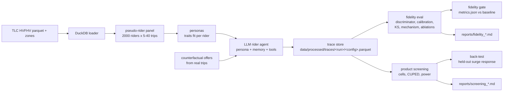

# rider-agent-sim

Pre-screening ride-hailing product interventions with LLM-agent simulation,
validated against real NYC TLC behavior -- before burning A/B traffic.

## The problem

Marketplace teams typically test pricing, surge, and messaging interventions
with live A/B experiments, which are slow, expensive, and risky (bad surge
changes hurt riders in production). This repo replaces the first screening
stage with *generative rider simulation*: a panel of pseudo-riders built from
real NYC TLC trip records, each fitted with a data-grounded persona, whose
accept/reject decisions on counterfactual offers are produced by an LLM agent
(memory + tool use). The simulated traces are then judged by a fidelity
pipeline -- discriminator, calibration, KS marginals, a surge-elasticity
mechanism check against a published range, and a held-out back-test -- and the
surviving interventions get a concrete real-A/B sample-size estimate. The CI
runs a regression gate on simulation *realism*, not just on code.

## Architecture



## Headline results

The table below is filled from the committed run
`reports/fidelity_final-offline.md` (`run_id=final-offline`, 200 riders, 2
offer replicates per rider, 2400 decisions per config, seed 7). **This run
used the deterministic offline backend** (see `rider_sim/eval/backends.py`)
because no live-API credits were available at the time of writing; LLM cost
and latency columns are therefore not reported -- they require a live run,
which is one command once an API key with credits is set (see Reproduce).
Nothing below is invented: every cell comes from `reports/metrics.json`.

| metric (full config) | value | note |
| --- | --- | --- |
| discriminator AUC | 1.000 (95% CI [1.000, 1.000]) | offline backend trivially separable; a live LLM run is the informative case |
| Brier vs real revealed acceptance | 0.340 overall | by segment: price-sens low 0.333 / mid 0.343 / high 0.344; wait-tol low 0.337 / mid 0.346 / high 0.337; transit False 0.340 / True 0.343 |
| KS marginals passed | 1 / 4 | only purpose_mix passes; fare/wait/hourly rates reject |
| measured surge elasticity | -0.734 (CI [-0.861, -0.631]) | sign correct, magnitude FAIL vs literature [-0.6, -0.4] (too elastic) |
| ablation AUC deltas vs full | logit -0.0018; others 0.0000 | LLM-side ablations inert under offline backend (documented) |
| ablation Brier deltas vs full | logit -0.2195; random -0.0274; others ~0 | the fitted logit baseline is much better calibrated |
| back-test | sim -0.517 vs real -1.360 (signed error +0.844), direction agrees, CI misses, verdict PARTIAL | equilibrium-vs-controlled caveat in the report |
| cost per 1,000 decisions | $0.00 (offline backend) | live-LLM cost unavailable; pricing model in `agent/llm.py` |
| decision latency p50 / p95 | 1.9 ms / 9.2 ms (offline backend) | not LLM latency |

The screening report (`reports/screening_final-offline.md`) ranks five
intervention cells: all are screened out in this run -- surge cells show a
large negative accept-rate lift (-0.455, CI [-0.561, -0.349]) and price cells
show zero lift because the offline backend is surge-sensitive but
price-insensitive. Every recommendation states its decision rule.

## What the ablations show

The ablation harness itself is the result: memory, persona reduction, tool
use, and prompt version are all wired and independently measurable. Under the
offline backend only the two baselines differ (the logit baseline's Brier of
0.120 vs 0.340 shows how far the trait-rule decision layer is from calibrated
behavior, and its elasticity of -1.013 is correctly FAILed against the
literature range). The LLM-side ablations are inert here by construction --
the offline backend parses only the persona and offer blocks -- so drawing
conclusions about which *LLM* components carry realism requires the live run
(one command; the response cache and CI gate make it a deterministic rerun).

## Limitations and threats to validity

- **Pseudo-riders, not real people.** TLC trip records have no rider ID; the
  panel is semi-synthetic (real trips, synthesized attribution). Only
  distributional statements are grounded in the real data.
- **Single city, single month.** NYC TLC HVFHV, 2024-01. No claims beyond
  this population.
- **LLM population bias.** Any live-LLM run samples one model's behavioral
  priors; per-model calibration against real data is exactly what the
  calibration and KS checks exist for, but they bound, not remove, the bias.
- **Prompt sensitivity.** Decisions are prompt-dependent; the v1/v2 ablation
  exists to measure this, and the prompt version is logged with every
  decision. Versioned prompts only.
- **The back-test is a directional gate.** The real surge-band ratio reflects
  the equilibrium allocation of rides (demand *and* supply), not a controlled
  experiment; exact agreement is not expected and a miss is reported
  honestly.
- **No post-accept churn.** Completed rides = accepted offers; abandonment is
  the complement of acceptance.
- **Offline backend numbers are pipeline self-tests.** Everything labeled
  "offline backend" validates the machinery, not LLM behavior.

## Quickstart

```bash
uv sync                       # or: make install
cp .env.example .env          # fill ANTHROPIC_API_KEY / OPENAI_API_KEY
make fetch-data               # idempotent TLC download (~450 MB)
make build                    # 2000-rider pseudo-rider panel
make personas                 # data-grounded personas
make evaluate                 # fidelity evaluation + ablations + report
make screen RUN_ID=<run>      # screening + back-test report
```

## Data pipeline

1. **Fetch** (`rider_sim/data/fetch.py`) -- downloads one month of HVFHV trip
   records and the taxi-zone lookup from the TLC CloudFront mirror into
   `data/raw/`, idempotently and atomically.
2. **Pseudo-rider panel** (`rider_sim/data/build_riders.py`) -- DuckDB
   filters usable trips; trips are bucketed into commute cells (pickup zone,
   hour, weekday/weekend, miles bucket), cells are KMeans-clustered into
   fallback neighborhoods, and 2000 pseudo-riders each get 5-40 real trips
   from a home cell drawn proportionally to real volume. Real observables are
   derived per trip: base fare, tips, miles, time, request-to-pickup wait,
   and `surge_ratio = driver_pay / (trip_miles * median_pay_per_mile)`.
3. **Personas** (`rider_sim/personas.py`) -- every persona is fit from its
   pseudo-rider's own trip history (price sensitivity from fare percentile
   and tip rate, wait tolerance from accepted waits, income from spend
   quartiles, loyalty from frequency, purpose mix from zone/hour rules).
4. **Agent** (`rider_sim/agent/`) -- `LLMRiderAgent` builds its prompt from
   persona + recalled memory + offer, runs up to 2 native tool-call rounds
   (`check_price_history`, `check_eta_reliability`,
   `check_transit_alternative`, all reading the processed Parquet), parses a
   strict `Decision` with one repair retry, and logs prompt version and
   parse failures. A DuckDB response cache keyed by sha256 of (provider,
   model, prompt, tools, temperature, seed) makes reruns free and
   deterministic; logit and random baselines share the interface.
5. **Fidelity eval** (`rider_sim/eval/`) -- grouped-K-fold LightGBM
   discriminator with bootstrap CI and named feature importances; per-segment
   reliability curves and Brier; four KS marginals with Bonferroni verdicts;
   surge-elasticity log-log regression with bootstrap CI against the
   literature range; seven ablation configs with permutation tests and cost.
6. **Screening** (`rider_sim/screening/`) -- paired per-rider cell lifts with
   rider-vs-model variance decomposition and CUPED pre-period adjustment;
   closed-form two-proportion power at real traffic volume; an auditable
   held-out back-test (surge never enters persona fitting).

### Literature benchmark

The mechanism check compares simulated surge elasticity against:

> Cohen, Hahn, Hall, Levitt & Metcalfe (2016), *Using Big Data to Estimate
> Consumer Surplus: The Case of Uber*, NBER Working Paper 22627. Own-price
> elasticity of demand for Uber rides: roughly **-0.4 to -0.6**.

Sign PASS requires a negative elasticity; magnitude PASS requires the
bootstrap CI to overlap this range.

## Fidelity gate (CI)

`.github/workflows/ci.yml` runs lint, strict mypy, pytest with coverage
(fail under 80%), and a **fidelity-gate** job: it rebuilds the pipeline,
runs the deterministic offline evaluation against the committed response
cache (`tests/fixtures/cache/llm_cache.duckdb`), and compares
`reports/metrics.json` with the committed baseline `eval_baselines.json`
(`python -m rider_sim.gate`). The build fails if the discriminator AUC
drifts outside its tolerance band, fewer KS marginals pass than the
baseline, or the elasticity sign flips -- a regression gate on simulation
realism. TLC data is cached between runs; `reports/` is uploaded as an
artifact.

## Docker

```bash
make docker-eval   # multi-stage image, non-root user, keyless:
                   # offline evaluate using the committed response cache
```

`docker-compose.yml` mounts `data/`, `reports/`, and `runs/` and reads
`.env` for provider keys.

## Reproduce (clean clone to report)

```bash
git clone <repo> && cd rider-agent-sim
uv sync
cp .env.example .env                       # optional: set an API key
make fetch-data                            # downloads + caches TLC 2024-01
make build                                 # 2000 pseudo-riders (seed 7)
make personas                              # 2000 personas (seed 7)
# deterministic, keyless fidelity run (what this README reports):
python -m rider_sim evaluate --run-id final-offline --ablations all \
  --provider offline --n-riders 200 --offers-per-rider 2 --seed 7
python -m rider_sim screen --run-id final-offline --backtest
# regression gate:
python -m rider_sim.gate
# live-LLM equivalent once a key with credits is set:
python -m rider_sim evaluate --run-id live-001 --ablations all \
  --provider auto --n-riders 200 --offers-per-rider 2 --seed 7
```

## Development

```bash
make lint   # ruff check + format check + mypy (strict)
make test   # pytest (coverage >= 80% enforced in CI)
```

Estimators and assumptions are written up in `docs/METHODS.md`.
All pipeline steps are deterministic for a fixed seed.
